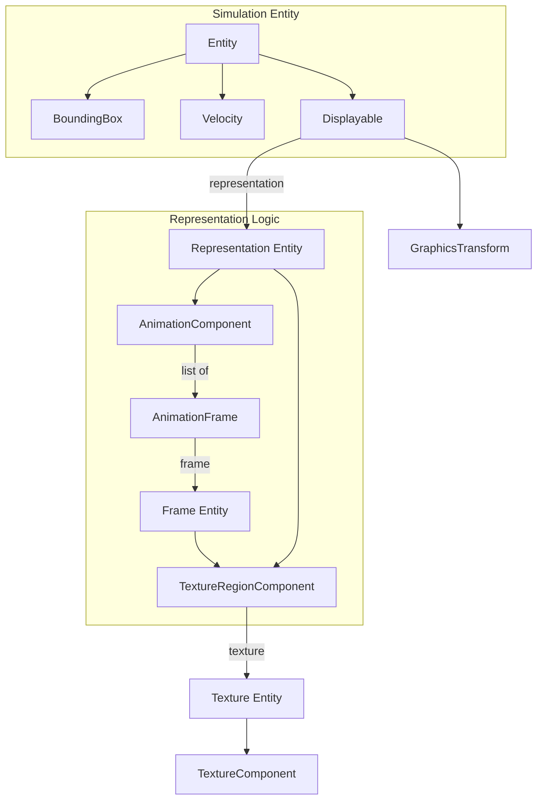
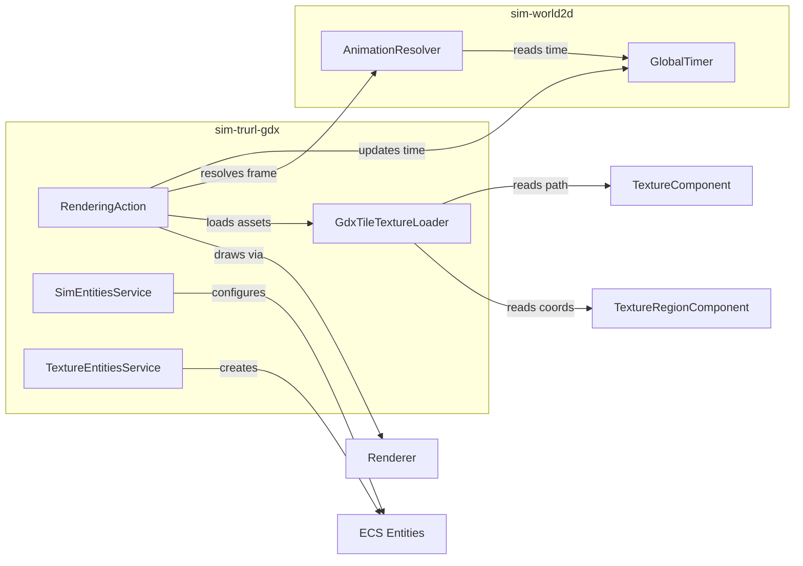

### Trurl 2D Simulation & LibGDX Rendering Extensions

This documentation covers `sim-world2d` (platform-agnostic 2D simulation) and `sim-trurl-gdx` (LibGDX-specific rendering and resource management).

---

### Core Abstractions: Components

The simulation state is represented by a set of interconnected components.

#### sim-world2d Components
*   **`BoundingBox`**: Defines the spatial presence (centerX, centerY, width, height) of an entity.
*   **`Velocity`**: (dx, dy) values for movement logic.
*   **`Displayable`**: Connects a simulation entity to its graphical representation (an `Entity` pointing to a `TextureRegion` or `Animation`) and optional `GraphicsTransform`.
*   **`GraphicsTransform`**: Per-entity graphical adjustments (alpha, scale, rotation, horizontalFlip, animationOffset).
*   **`AnimationComponent`**: A list of `AnimationFrame`s representing a sequence.
*   **`AnimationFrame`**: References a "frame" (an `Entity` with `TextureRegionComponent`) and its `duration`.
*   **`TextureRegionComponent`**: Defines a rectangular slice of a texture (x, y, width, height) and references a `TextureComponent`.
*   **`TextureComponent`**: Holds the `texturePath` to the physical image file.
*   **`Partition`**: Used for spatial indexing (SPATIAL type), holding a list of entities in a grid cell.

---

### Core Abstractions: Services

Services implement the logic acting upon components.

#### sim-world2d Services
*   **`AnimationResolver`**: Determines which `AnimationFrame` to use based on the `GlobalTimer` and the entity's `animationOffset`.
*   **`PartitionService`**: Creates and manages `Partition` entities to group simulation entities spatially.
*   **`CollisionService`**: (Conceptual, based on `sim-world2d` structure) Handles intersection logic between `BoundingBox`es.
*   **`StateMachineService`**: (Conceptual) Manages `StateMachine` component transitions.

#### sim-trurl-gdx Services & Actions
*   **`TextureEntitiesService`**: Loads LibGDX `TextureAtlas` resources and automatically creates `Texture`, `TextureRegion`, and `Animation` entities in the ECS.
*   **`SimEntitiesService`**: Provides a fluent `EntityManipulator` DSL to create/modify entities with 2D/rendering components.
*   **`GdxTileTextureLoader`**: Bridges ECS `TextureRegionComponent`/`TextureComponent` to actual LibGDX `TextureRegion` and `Texture` objects.
*   **`RenderingAction`**: An `EntityProcessor` that iterates over `Displayable` entities, resolves animations, and calls the `Renderer`.

---

### Component Interaction Diagram

How components relate to each other:

### Rendering Pipeline & Dependencies

How services interact during a frame:

### Data Flow Summary
1.  **Creation**: `TextureEntitiesService` populates the ECS with textures/animations from an atlas.
2.  **Simulation**: Logic (Movement, Collisions) updates `BoundingBox` and `Velocity`.
3.  **Resolution**: `RenderingAction` uses `AnimationResolver` to pick the current frame from `AnimationComponent` based on `GlobalTimer`.
4.  **Loading**: `GdxTileTextureLoader` fetches the actual LibGDX `TextureRegion` using paths/coordinates from components.
5.  **Drawing**: `RenderingAction` applies `GraphicsTransform` and sends final draw commands to the LibGDX `Renderer`.
